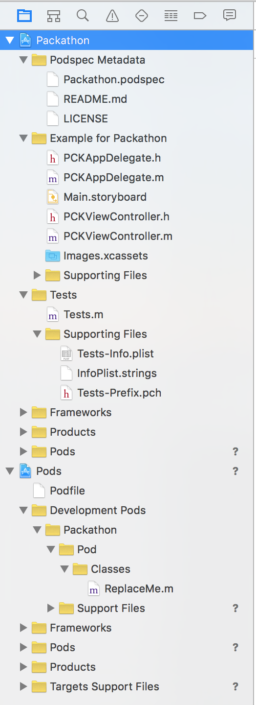
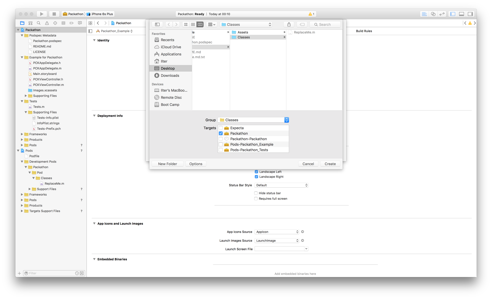
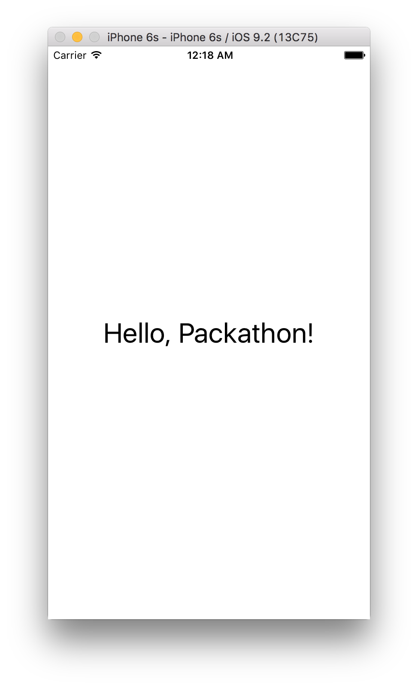
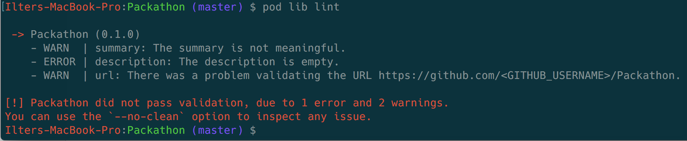

# Örnek CocoaPods Kütüphanesi

Bu belgede en hızlı şekilde örnek bir [CocoaPods](https://cocoapods.org) kütüphanesi (pod'u) oluşturmayı anlatıyor.
Dil olarak Objective-C kullanacağız, oluşturulan projede örnek bir uygulamamız olacak ve test için [Specta](https://github.com/specta/specta) ve XCTest kullanacağız.

## Nelere ihtiyacınız var?

* Doğal olarak bir Mac. :)
* [Xcode](https://developer.apple.com/xcode/)
* CocoaPods gem’i
* Kaynak kod versiyonlama için tercihen Git
* Sürüm olarak OS X 10.11.3, Xcode 7.2 ve CocoaPods 0.39.0 kullanılarak anlatılmıştır.

## CocoaPods kurulumu

OS X ile beraber gelen ruby ve gem’i kullanacaksanız:

	$ sudo gem install cocoapods

[rvm](http://rvm.io) ya da [rbenv](https://github.com/rbenv/rbenv) gibi ruby versiyon yönetimi aracı kullanıyorsanız:

	$ gem install cocoapods

## CocoaPods kütüphanesi oluşturulması

Projenizi saklamak istediginiz dizine gidip:

	$ pod lib create Packathon

Bu aşamada bir kaç soru sorulacaktır. Bunlar sırasıyla şu şekilde cevaplıyoruz:

	$ What language do you want to use?? [ ObjC / Swift ]
	   > ObjC

	$ Would you like to include a demo application with your library? [ Yes / No ]
	   > Yes

	$ Which testing frameworks will you use? [ Specta / Kiwi / None ]
	   > Specta

	$ Would you like to do view based testing? [ Yes / No ]
	   > No

	$ What is your class prefix?
	   > PCK

Sonrasında verdiğimiz cevaplar doğrultusunda `pod` gerekli kurulumu yapacaktır ve oluşturduğu Xcode workspace dosyasını bizim için açacaktır.

## Dizinler ve dosyalar

Oluşturulan Packathon dizinine gittiğimizde şu içeriği göreceğiz:

|--|--|
| Example/ | Örnek uygulamamızın ve oluşturduğumuz kütüphanenin de bağlanmış olduğu Xcode projemizin dizini |
| Pod/ | Bizim oluşturacağımız kütüphanemizin kaynak kodları ve diğer gereksinimlerinin bulunduğu dizin |
| Packathon.podspec | Geliştireceğimiz kütüphanenin diğer kullanıcılar tarafından kullanılmasını sağlayacak olan ve kütüphanemizle ilgili bilgiler içeren dosya |
| LICENSE | Kütüphanemiz için belirlediğimiz lisans türü ve koşulları |

Ana dizinle birlikte bir kaç önemli alt dizine de değinmek gerekirse:

|--|--|
| Pod/Classes/ | Kütüphanemiz için oluşturacağımız kaynak kodlarımızın bulunacağı dizin |
| Pod/Assets/ | Kütüphanemizde kullanacağımız görsel, ses, vb gereksinimlerin yerleştirileceği dizin |
| Example/Packathon/ | Örnek uygulamamızın kaynak kodlarının ve gereksinimlerinin bulunduğu dizin |
| Example/Tests/ | Örnek uygulamamız ve kütüphanemiz için yazdığımız testlerin bulunduğu dizin |
| Example/Pods/ | Kendi kütüphanemiz ile birlikte diğer gereksinim duyulan pod’ların yüklendiği dizin. Burası ile doğrudan etkileşimde bulunmuyoruz. |
| Example/Podfile | Kendi kütüphanemizle birlikte diğer gereksinim duyulan pod’ların yüklenmesi için tanımlanan dosya. |

## Geliştirme

Şimdi tek yapmamız gereken kütüphanemizi geliştirmek!

	$ pod lib create Packathon

komutu ile birlikte açılan Xcode projemize dönüyoruz. Sol tarafta açık olan ‘Project navigator’ kısmından Pods projesi altında sırasıyla 

	Development Pods > Packathon > Pod > Classes

gruplarını açtığımızda `ReplaceMe.m` adında bir sınıf göreceğiz. 

Tam da bize dediğini yapacağız. :) `Classes` grubuna sağ tıklayarak `New File…` diyoruz ve ilk sınıfımızı oluşturuyoruz. 

Sınıfı oluştururken `Targets` kısmında kendi kütüphanemizin seçili olduğundan emin olun.

Artık `ReplaceMe.m` dosyasını da silebiliriz. :)

Bu aşamada çok önemli bir husus, sınıfımızı oluşturduktan sonra projemizin dizininde, yani `Example` dizininde, şu komutu çalıştırmaktır:

	$ pod install

Bu komut az önce oluşturduğumuz sınıfımızı örnek projemize entegre eden kütüphaneye bağlayarak örnek projemizde kullanıma sunar.

Sonrasında bileğimize kuvvet geliştirme. :) Biraz uğraş sonrasında sonuç:

## Kütüphanenin doğrulanması

	$ pod lib lint

Bize yardımcı olacak komutumuz bu. `Packathon` dizinimizde bu komutu çalıştırdığımız zaman `pod` komutu oluşturduğumuz kütüphaneyi yine aynı dizindeki `Packathon.podspec` dosyasındaki tanımlara uyup uymadığını kontrol eder ve bir hata varsa bize bildirir.

Mesela burada podspec dosyamızda kütüphanemiz için tanım girmediğimizi söylüyor. İlgili hataları giderdiğimizde sonuç:

## Test

Kütüphanemiz için testlerimizi de yazdık. (yazdık dimi?!) E bide bunu bir continuous integration sunucusu test etsin.

Testlerimizi [Travis-CI](https://travis-ci.org) üzerinde koşmak istersek tek yapmamız gereken Git repo’muzda bir `.travis.yml` dosyası oluşturmak ve Travis-CI üzerinde bu repo’muza erişim izni vermek. 

Sonrasında projemiz üzerinde çalışıp, her bir commit’imizi repo’muza aldığımızda Travis-CI bizim için testlerimizi koşacak ve başarısız olan bir sonuç olması durumunda bize haber verecek. :)

## Kütüphanemizin yayınlanması

CocoaPods’un güzelliklerinden birisi de oluşturduğunuz kütüphanenizi hızlıca yayınlayabilmeniz.

	$ pod trunk register

komutu ile daha önceden yapmadıysanız [CocoaPods trunk’a](https://guides.cocoapods.org/making/getting-setup-with-trunk.html) kaydolun. Basitçe e-posta adresiniz ve adınız gibi bilgileri . Sonrasında: 

	$ pod trunk push

diyerek oluşturduğunuz kütüphanenizin binlerce pod arasında yer almasını sağlayabilirsiniz. :)

İyi hacklemeler! :)